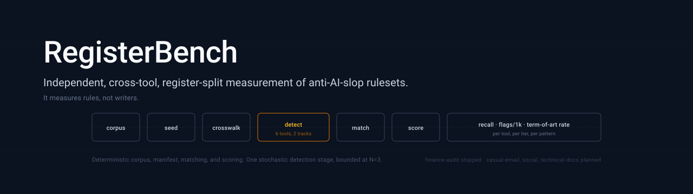

<p align="center">
  
</p>

<h1 align="center">RegisterBench</h1>

<p align="center">
  <strong>Every published number in this niche is self-graded.<br/>
  RegisterBench measures rules, not writers.</strong>
</p>

<p align="center">
  <a href="https://opensource.org/licenses/MIT"></a>
  <a href="https://www.python.org/"></a>
  <a href="https://nodejs.org/"></a>
  
  
  
</p>

<p align="center">
  <a href="#-why-i-built-this">Why</a> •
  <a href="#%EF%B8%8F-the-measurement-principle">Principle</a> •
  <a href="#-where-is-the-judgment">Where is the Judgment?</a> •
  <a href="#-what-ships-in-v01">What Ships</a> •
  <a href="#-v01-results-finance-audit">Results</a> •
  <a href="#-the-executable-subset-gap">Executable-Subset Gap</a> •
  <a href="#-stack">Stack</a> •
  <a href="#-how-to-read-this-repo">How to Read</a> •
  <a href="#-reproduction">Reproduction</a> •
  <a href="#%EF%B8%8F-build-decisions--lessons-learned">Build Decisions</a> •
  <a href="#-limitations">Limitations</a> •
  <a href="#%EF%B8%8F-roadmap">Roadmap</a> •
  <a href="#-prior-art--acknowledgements">Prior Art</a>
</p>

---

## 🧭 Why I Built This

I'm an ACCA with audit roots who pivoted into AI automation architecture. Working in audit, you learn that *"the policy says X"* and *"the code does X"* are different sentences, and the second one is the only one that matters when the regulator shows up.

That gap turns out to be the central finding of this repo, and it is measurable. The anti-AI-slop ecosystem ships rulesets as prose documents. The most rigorous of them, `avoid-ai-writing`, also ships a deterministic regex engine that implements the executable subset of the same catalog. Nobody had measured the distance between the two faces. The answer on this register is **26 points of recall**: 72.7% for the prose read by a model, 46.7% for the engine, same repository, same pinned commit, same rules. The document says X. The code does a demonstrably narrower X.

The second gap is the one my audit background is actually for. Every tool in this space maintains word lists that fire on regulated financial language. On 111,313 words of real pre-ChatGPT SEC filings, Tier 1 `comprehensive` fires on **`comprehensive income`**, a term defined in FASB ASC 220, 25 times over. Worse, one tool's adverb ban flags **"present fairly, in all material respects"**, the auditor's opinion sentence prescribed by PCAOB AS 3101.08, and its passive-voice ban flags the standard internal-control-over-financial-reporting definition. A filer cannot rewrite any of those. No existing benchmark would have caught this, because measuring it requires knowing which phrases are legally load-bearing.

**On why measurement and not another editor.** The ecosystem has two maintained, capable editors already. What it does not have is a neutral scorekeeper: nearly every published number is a tool's own rules run against that tool's own fixtures. `unslop` is the only tool in the cohort that publishes benchmark numbers at all, and even its comparison table concedes that the blind human-preference result is *"not publicly measured"* for a competitor. That is the gap this fills.

This project sits alongside a portfolio thesis on defensible AI in regulated finance:

- **[FinAgent OS](https://github.com/RZ-Logic/finagent-os)**: *governance.* SOX-defensible properties enforced as Postgres triggers and missing-by-design tool surfaces.
- **[regulated-rag](https://github.com/RZ-Logic/regulated-rag)**: *retrieval.* Citation grounding and refusal enforced in code rather than promised in prompts.
- **RegisterBench** (this repo): *measurement.* The same discipline turned outward, applied to somebody else's published claims.

---

## 🛡️ The Measurement Principle

> **A tool's own fixtures cannot measure that tool. Recall on planted ground truth and flag behavior on verifiably human text are two different questions, and a benchmark has to answer both.**

Recall alone rewards a ruleset for firing constantly. Flag density alone rewards a ruleset for firing never. Reported together, on ground truth that was planted by hand before any tool ran, they describe a tool honestly. Neither number is a verdict on its own.

**On what a flag on human text means.** The human corpora predate November 2022, so no flag on them can be an AI catch. That does not automatically make a flag *wrong* as style advice. The claim these tools make is removing AI tells. A rule that fires densely on a 2019 10-K is demonstrating that it encodes a style preference, not an AI signal. Both metrics are reported and readers judge the rows.

**RegisterBench never claims or implies AI authorship of any text, anywhere.** It has no authorship-detection component, produces no "AI risk" score, and takes no position on who or what wrote any document it processes. It measures rules against a manifest.

**The empirical proof of the ground truth:** every one of the 122 planted instances was recorded in [`seeded/finance-audit/manifest.json`](seeded/finance-audit/manifest.json) at the moment it was written into a draft, with its exact span, canonical pattern ID, tier, and whether it was inserted or retained from the source filing. [`scripts/verify_manifest.py`](scripts/verify_manifest.py) re-locates every span in every draft and fails loudly on drift. No plant was reconstructed after the fact, and no scoring run can silently move the target.

---

## 🎯 Where is the Judgment?

This is the architectural through-line, adapted from the *"Where is the AI?"* enumeration in [FinAgent OS](https://github.com/RZ-Logic/finagent-os). Every stage of the benchmark is deterministic except the prompt-track detection stage itself, and that one is bounded at N=3 with mean, min, and max reported.

| # | Stage | Deterministic? | What it does |
|---|---|:-:|---|
| 1 | **Corpus acquisition** | ✅ | EDGAR submissions API by CIK, filing-date window, Item 7 and audit-opinion section slicing. Accession numbers and retrieval date written to [`PROVENANCE.md`](corpora/finance-audit/PROVENANCE.md) per file. |
| 2 | **Prose filtering** | ✅ | Line-level filter dropping numeric-majority and heading-fragment lines from flattened filing tables. `raw/` is preserved untouched as the provenance record. |
| 3 | **Seeding** | ✅ *(manual, recorded at write time)* | Patterns planted by hand into lightly adapted real filing text. Never model-generated, which would contaminate the ground truth. |
| 4 | **Manifest verification** | ✅ | Every span re-located, word counts and plant counts range-checked, every pattern ID validated against the crosswalk. Exits nonzero on any drift. |
| 5 | **Crosswalk** | ✅ | 29 canonical pattern IDs mapped to each tool's own rule identifiers, recording which patterns each tool claims at all. |
| 6 | **Code-track detection** | ✅ | `avoid-ai-writing` `analyzeText()` and `unslop` `humanize_deterministic_with_report()`, both SHA-pinned. Byte-identical across runs. |
| **7** | **Prompt-track detection** | **❌ stochastic** | Each tool's ruleset files verbatim, uniform detect-only instruction appended, model pinned to `claude-sonnet-5`. **N=3 independent runs per seeded draft**, mean/min/max reported; the human corpus is a single pass per tool. ⚠️ **v0.1's published numbers did not run through this stage as specified.** They came from an equivalent subagent path in which the rulesets were delivered as task instructions rather than in the API `system` parameter. See [Limitations](#-limitations). |
| 8 | **Flag matching** | ✅ | Character-overlap at threshold 0.5 against the manifest span, or quoted-text containment. Document-level rules (density, rates, rhythm) match by crosswalked pattern. Unmatched flags logged separately. |
| 9 | **Scoring** | ✅ | Recall overall, by tier, by pattern. Flags per 1,000 words. Term-of-art violation rate against the citation-backed whitelist. |

Eight deterministic stages, one stochastic stage, bounded and reported with its spread.

> **The principle:** A benchmark whose own pipeline is stochastic cannot distinguish a tool's variance from its own. Isolate the stochasticity to the single stage that genuinely requires it, pin the model, run it N times, and publish the spread so readers can see how much of any gap is noise.

---

## 🧱 What Ships in v0.1

```
┌────────────────────────────────────────────────────────────────────────────┐
│                                                                            │
│   One seeded draft (fin-04, adapted from Delta's FY2020 10-K MD&A):        │
│                                                                            │
│     Base text        ← real pre-2022 filing prose, source cited            │
│       │                                                                    │
│       ├─ plant  str-staccato-fragments   "Demand collapsed. Fleets         │
│       │                                   parked. Cash burned."            │
│       ├─ plant  phr-significance-inflation "a watershed moment for the     │
│       │                                     industry"                      │
│       ├─ plant  str-false-agency          "The market decided for us."     │
│       ├─ plant  lex-t1-vocab              "daunting"                       │
│       └─ ... 12 plants total, spans recorded at write time. Tier coverage  │
│           is complete across the 10-draft set, not within any one draft.   │
│                                                                            │
│     distractor      ← "unprecedented", retained from the real filing.      │
│                       Never counted in recall. Flags on it feed the        │
│                       false-positive analysis instead.                     │
│                                                                            │
│     6 tools × detect-only  ← 2 deterministic engines, 4 prompt rulesets    │
│       │                      at N=3 each                                   │
│       ▼                                                                    │
│     Span match at 0.5 overlap → recall per tier, per pattern               │
│                                                                            │
│   Separately, the same 6 tools run over 111,313 words of real filings      │
│   with zero plants, where every flag is a style preference by construction. │
│                                                                            │
└────────────────────────────────────────────────────────────────────────────┘
```

### Component overview

| Component | What it is | Role of the model |
|-----------|-----------|:-:|
| **Corpus** ([`corpora/finance-audit/`](corpora/finance-audit/)) | 18 documents, 111,313 clean words. 10-K MD&A sections and audit opinions from 10 issuers, filed 2020-07-30 to 2021-03-24 (fiscal years ending 2020). Accession numbers and URLs per file. | None |
| **Term-of-art whitelist** ([`whitelist.json`](corpora/finance-audit/whitelist.json)) | 13 defined terms, each with a PCAOB, FASB ASC, or statutory citation and a note on the collision it creates. | None |
| **Seeded drafts** ([`seeded/finance-audit/`](seeded/finance-audit/)) | 10 drafts, 330 to 397 words, 122 planted instances across a 29-pattern taxonomy spanning 6 tiers. Manual planting, recorded at write time. | None |
| **Crosswalk** ([`crosswalk/patterns.json`](crosswalk/patterns.json)) | Canonical IDs mapped to all 6 tool faces, with claimed-versus-unclaimed recorded per pattern. | None |
| **Code-track runners** ([`runners/code_track/`](runners/code_track/)) | Node and Python invocations, SHA-pinned, emitting a normalized findings schema. | None |
| **Prompt-track harness** ([`runners/prompt_track/`](runners/prompt_track/)) | Anthropic API harness. Ruleset files verbatim as system prompt, detect-only instruction appended, N=3, model-pinned. Gated behind `--approved` because it spends money. | Detection only |
| **Scorer** ([`scripts/score.py`](scripts/score.py)) | Recall (overall, by tier, by pattern), flags per 1k, term-of-art rate, prompt-track variance. | None |

### Tools under test

Six faces across five repositories. `avoid-ai-writing` appears twice by design, because it ships both a prose ruleset and a regex engine, and the whole point is that those are different artifacts.

| Tool | Track | Pinned SHA | What it is |
|---|:-:|---|---|
| [avoid-ai-writing](https://github.com/conorbronsdon/avoid-ai-writing) SKILL.md | prompt | `27156c7a` | 3 vocabulary tiers, 6 context profiles, tolerance matrix |
| [avoid-ai-writing](https://github.com/conorbronsdon/avoid-ai-writing) detector | code | `27156c7a` | 45-category deterministic engine, zero dependencies |
| [stop-slop](https://github.com/hardikpandya/stop-slop) | prompt | `8da1f030` | SKILL.md plus 3 reference files, distribution leader |
| [no-ai-slop](https://github.com/petergyang/no-ai-slop) | prompt | `61c21c35` | 17 named patterns, first-class detect mode |
| [the-antislop](https://github.com/aplaceforallmystuff/the-antislop) | prompt | `5edbf856` | Wikipedia-derived tiers, additive point scoring |
| [unslop](https://github.com/MohamedAbdallah-14/unslop) deterministic layer | code | `5af59d9f` | 15 Python regex rule families, detect and rewrite |

---

## 📊 v0.1 Results: finance-audit

Run dated 2026-07-26. Model `claude-sonnet-5`. 122 planted instances across 10 drafts; 111,313 words of human corpus. Full tables: [`results/finance-audit_2026-07-26.md`](results/finance-audit_2026-07-26.md) · raw per-tool findings: [`results/raw_*.json`](results/).

### Reading the tables

**The four metrics.** Two describe what a tool catches, two describe what it disturbs.

| Metric | What it measures | Higher is |
|---|---|:-:|
| **Recall (mean)** | Of the 122 pattern instances planted by hand into the seeded drafts, the share a tool flagged. Each quoted finding is credited to at most one plant (see [matching](#%EF%B8%8F-build-decisions--lessons-learned), decision 1). Averaged across 3 independent runs for prompt-track tools. | better |
| **Recall range** | Lowest and highest single-run recall across those 3 runs, so readers can see how much of any gap between tools is run-to-run noise. Deterministic engines produce one value and no spread. | narrower |
| **Flags/1k human** | Total flags a tool raised per 1,000 words of the human corpus. Because that corpus predates November 2022, no flag on it can be an AI catch, so this is a measure of how readily a ruleset fires on ordinary filing prose. | context |
| **Term-of-art violations/1k** | The subset of those flags landing inside a defined regulatory term from the [whitelist](corpora/finance-audit/whitelist.json), per 1,000 words. These are phrases a filer is not free to rewrite, so a flag here is the least defensible kind. | lower |

Flags per 1k has no "good" direction on its own, which is the point of reporting it next to recall rather than instead of it. A tool that never fires scores well on it and badly on recall.

**The six tiers.** The 29-pattern canonical taxonomy is grouped by *what kind of thing* a pattern is, because that determines what sort of detection can find it. Tier sizes are uneven because they mirror how the planted drafts were written, not an attempt at balance.

| Tier | Plants | What it is | Examples from the drafts |
|---|:-:|---|---|
| **lex-1** | 23 | Single words or fixed short phrases flagged unconditionally, wherever they appear. | `seamless`, `daunting`, `cutting-edge`, `testament to`, `utilizes` |
| **lex-2** | 12 | Vocabulary flagged only when several co-occur in a passage, the cluster-gated tier. | `foster`, `cornerstone`, `harnessing`, `multifaceted`, `poised` |
| **lex-3** | 12 | Ordinary words flagged only above a repetition threshold, the density-gated tier. | `significant`, `innovative`, `effective`, `dynamic` |
| **phrasal** | 42 | Multi-word formulas with a recognisable shape rather than a fixed string. | "marking a pivotal moment", "experts believe", "Here's the thing:", "in order to" |
| **structural** | 29 | Sentence and paragraph shapes. No fixed string exists to match, so finding these requires reading form rather than tokens. | "The question isn't X. It's Y.", "Demand collapsed. Fleets parked.", em-dash rhythm, false agency |
| **conversational** | 4 | Chat-assistant residue left in a document that is not a chat. | "I hope this summary helps", "That's a great question", "As of my last update" |

Cells in the tier table read *matched / planted*, and for prompt-track tools matched is a mean across 3 runs, so fractional values are expected. The tier split is the most diagnostic view in this repo: it is where the [executable-subset gap](#-the-executable-subset-gap) becomes visible, because deterministic engines hold their own on the lexical tiers and collapse on the structural one.

### Headline

| Tool | Track | Recall (mean) | Recall range | Flags/1k human | Term-of-art violations/1k |
|---|:-:|---|---|---|---|
| avoid-ai-writing skill | prompt | **72.7%** | 71.3% to 73.8% | 1.34 | 0.009 |
| stop-slop | prompt | 59.8% | 59.8% to 59.8% | **6.90** | **0.243** |
| no-ai-slop | prompt | 55.5% | 54.1% to 56.6% | 0.55 | **0.0** |
| avoid-ai-writing detector | code | 46.7% | deterministic | 0.51 | 0.081 |
| the-antislop | prompt | 45.4% | 43.4% to 46.7% | 0.70 | **0.0** |
| unslop deterministic | code | 28.7% | deterministic | 2.06 | 0.171 |

### Recall by tier

Percentages, because prompt-track cells are 3-run means. Planted counts per tier are in the tier table above. Full fractions and per-run spread: [`results/finance-audit_2026-07-26.md`](results/finance-audit_2026-07-26.md).

| Tier | aaw skill | stop-slop | no-ai-slop | aaw detector | the-antislop | unslop |
|---|---|---|---|---|---|---|
| lex-1 (always-flag vocabulary) | **94.2%** | 39.1% | 59.4% | 87.0% | 37.7% | 52.2% |
| lex-2 (cluster-gated vocabulary) | 41.7% | 25.0% | **47.2%** | 16.7% | 0.0% | 16.7% |
| lex-3 (density-gated vocabulary) | 2.8% | **47.2%** | 13.9% | 0.0% | 11.1% | 0.0% |
| phrasal | **81.8%** | 69.0% | 61.1% | 59.5% | 54.8% | 40.5% |
| structural | **83.9%** | **83.9%** | 71.3% | 27.6% | 66.7% | 6.9% |
| conversational | **75.0%** | 50.0% | 8.3% | 50.0% | **75.0%** | 50.0% |

### What the data shows

**Recall and flag density are decoupled, not traded off.** The intuition that a tool flagging more will catch more does not hold here. `stop-slop` fires 6.90 times per 1,000 words, five times the rate of `avoid-ai-writing skill` at 1.34, and still scores 12.9 points lower on recall. One tool is strictly better on both axes at once, which is a dominance relation rather than a tradeoff. The two metrics are measuring different properties: recall measures whether a ruleset *covers* the taxonomy, and flag density measures whether its rules are *indiscriminate*. A ruleset can be simultaneously blunt and narrow.

**Aggression concentrates in very few rules.** 87.4% of `stop-slop`'s 768 human-corpus flags come from two rules: Adverbs (446 flags, 58.1%) and Passive Voice (225 flags, 29.3%). Both are hard global bans. In filing prose, "primarily driven by", "partially offset by", and "was recorded" are the register rather than a tell. Its vocabulary table is 11 business-jargon entries (`references/phrases.md`), which overlaps the canonical always-flag list at only two terms, so it reaches 39.1% on that tier while firing five times more often than any other tool overall. High volume did not buy coverage.

**Regulated language collides with rulesets in two distinct ways, and the second is the serious one.** The systematic collision is `comprehensive`, a Tier 1 always-replace word, firing on `comprehensive income`, a term defined in FASB ASC 220 that occurs 25 times in the corpus: 9 hits for the detector and 19 for `unslop`. The severe collision belongs to `stop-slop`, whose 27 violations land almost entirely on mandated audit language: **"present fairly, in all material respects"** (PCAOB AS 3101.08, flagged as an adverb violation on *fairly*), **"reasonable assurance"** inside the standard ICFR definition paragraph, and "effective internal control over financial reporting was maintained in all material respects" (Exchange Act Rule 13a-15(f) wording, flagged as passive voice). Flagging a defined accounting term is embarrassing. Flagging the auditor's opinion sentence and the ICFR definition would break the filing. Two tools score 0.0 here, `no-ai-slop` and `the-antislop`, because neither carries vocabulary that overlaps the whitelist at all: their `toa_examples` arrays are empty rather than merely small.

**Variance is small, but it does not separate every adjacent pair.** Widest spread across three independent runs is `the-antislop` at 3.3 points, and `stop-slop` returned an identical 73/122 in all three runs. The top three tools are separated by non-overlapping ranges. The bottom of the table is not: `the-antislop`'s best run reaches 46.7%, which exactly ties the `avoid-ai-writing detector`'s deterministic 46.7%, so those two rows are a tie rather than an ordering and should not be read as a rank. The spread is published precisely so that distinction is visible.

---

## 🔬 The executable-subset gap

The most interesting result is the one where a single repository competes against itself.

`avoid-ai-writing` ships a 714-line SKILL.md and a 45-category regex engine. Same commit, same rule catalog, same taxonomy. Scored against the same 122 plants, the prose reaches 72.7% and the engine reaches 46.7%, a gap of **26.0 points**. The gap is not distributed evenly, and where it concentrates is the whole story.

Skill cells are means across 3 runs; detector cells are a single deterministic run.

### Where the two faces agree

| Pattern | Skill | Detector |
|---|---|---|
| `lex-t1-vocab` (delve, robust, seamless, testament to) | 18/18 | 18/18 |
| `phr-filler-wordy` (in order to, due to the fact that) | 4/4 | 4/4 |
| `phr-generic-conclusion` (only time will tell) | 4/4 | 4/4 |
| `phr-hedge-stack` (could potentially, may eventually) | 4/4 | 4/4 |
| `str-em-dash` | 4/4 | 4/4 |
| `str-formatting-slop` (bold overuse) | 2/2 | 2/2 |
| `phr-transition` (Moreover, Furthermore, Firstly) | 4.67/7 | **5/7** |

On anything reducible to string presence, the engine is not merely adequate, it is perfect and identical. Regex is the right tool for "does the token `delve` appear." On transition words the engine actually beats the prose slightly, which is the expected direction for a rule that is a fixed word list.

### Where the engine reaches zero

| Pattern | Skill | Detector |
|---|---|---|
| `phr-throat-clearing` ("Here's the thing:", "Let me be clear:") | 4/4 | **0/4** |
| `str-staccato-fragments` ("Demand collapsed. Fleets parked.") | 3.67/4 | **0/4** |
| `str-negative-parallelism` ("The question isn't X. It's Y.") | 3/3 | **0/3** |
| `str-negative-listing` ("Not a slogan. Not a poster. An operating system.") | 2/2 | **0/2** |
| `str-rhetorical-setup` ("So what changed this year?") | 2/2 | **0/2** |
| `str-rule-of-three` | 2/4 | **0/4** |
| `phr-signposting-meta` ("In this memorandum, we'll walk through") | 1.67/3 | **0/3** |
| `str-colon-reveal` ("The takeaway: cloud is the business.") | 1/2 | **0/2** |
| `str-false-agency` ("The market decided for us.") | 1/2 | **0/2** |
| `phr-false-range` ("from startups to superpowers") | 1/2 | **0/2** |
| `str-synonym-cycling` | 0.67/1 | **0/1** |
| `con-chatbot-artifact` ("I hope this summary helps") | 1/2 | **0/2** |

Twelve patterns where the engine never fires and the prose does. Every one requires reading a sentence and judging its shape against its neighbours. At the tier level the same split appears cleanly: structural recall is 83.9% for the prose and 27.6% for the engine.

One caveat on that 27.6%, surfaced by a completeness review of this repo. Six of the engine's eight structural matches come from document-level rules, which report a rate rather than locate a span: four `em-dash` matches whose flag text is `"2 em dashes in 371 words"`, and one `formatting` flag credited to both formatting plants in the same draft. Scored on located spans alone, the engine's structural recall is 2/29, identical to `unslop`. The concession is deliberate and is described in build decision 1, and it runs *against* the headline by making the engine look better, so it is not inflating the gap. But the honest reading of that cell is that the engine mostly does not locate structural slop; it reports that some exists.

### This is documented architecture, not a defect

The repository's own [`detector/CATEGORIES.md`](https://github.com/conorbronsdon/avoid-ai-writing/blob/main/detector/CATEGORIES.md) maintains a "skill-only" list for exactly these rules, naming them as LLM-judgment patterns with no detector type. The maintainer is not claiming the engine is complete, and RegisterBench is not accusing it of being incomplete. The contribution is putting a number on a boundary that both sides already knew existed: on this register, 26.0 points of the canonical taxonomy is judgment that a deterministic engine does not attempt.

Not all 26 points are pure judgment, and the honest decomposition matters. Roughly 19 points come from the twelve patterns above where the engine has no rule at all. The remainder is threshold and gating divergence rather than absence: the engine's cluster gate costs it 25 points of `lex-t2-cluster` recall against the prose reading the same word list, and its 3% density floor costs the whole `lex-3` tier (see build decision 4). Both faces score 0.0 on `lex-3`, so that tier contributes nothing to the gap.

That number is useful in three directions. For a user, it says a regex pre-commit hook is a floor rather than a substitute. For the maintainer, it locates where engine investment would pay. For anyone comparing tools, it says an artifact's execution mode matters as much as its rule count, and a benchmark that measures only one face of a two-faced tool is measuring the wrong thing.

> **The principle:** When a project ships both a specification and an implementation of that specification, they are two artifacts and they deserve two measurements. The distance between them is not a footnote, it is a finding.

---

## 🔌 Stack

| Layer | Tool | Why |
|-------|------|-----|
| Corpus source | SEC EDGAR submissions API + Archives | Public domain, machine-addressable by CIK, filing dates are the provenance. No scraping of anything gated. |
| Corpus extraction | Python stdlib `html.parser` | 18 documents does not justify a dependency. Block-level tag handling is enough to recover paragraph structure from filing HTML. |
| Code-track invocation | Node 18+ (`require`), Python 3.10+ (direct import) | Each engine called through its own documented API rather than its CLI, which bypasses file-type gates and keeps the findings schema stable. |
| Prompt-track invocation | Anthropic Messages API, stdlib `urllib` | Model alias pinned in every result file. Retry with backoff on 429 and 529. No SDK dependency for ~200 lines of harness. |
| Scoring | Python stdlib | Span arithmetic and set membership. Nothing here needs pandas. |
| Result format | JSON per run, Markdown per register | Raw findings are diffable and re-scorable without re-running any tool. |

**No infrastructure novelty.** Everything here is stdlib, one HTTP API, and six cloned repositories. The contribution is the application layer: the seeded-manifest methodology, the citation-backed term-of-art whitelist, the crosswalk that lets six different taxonomies be compared under one protocol, and the decision to measure both faces of a two-faced tool.

---

## 📖 How to Read This Repo

For a reviewer with limited time:

1. **[The "Where is the Judgment?" table](#-where-is-the-judgment)** above. ~90 seconds. The benchmark's stance on its own stochasticity, in one table.
2. **[The executable-subset gap](#-the-executable-subset-gap)** above. ~4 minutes. The headline finding and why it is a finding rather than an accusation.
3. **[`corpora/finance-audit/whitelist.json`](corpora/finance-audit/whitelist.json)**. ~3 minutes. 13 defined terms with citations. This is the file that makes the false-positive claims defensible rather than aesthetic.
4. **[`seeded/finance-audit/manifest.json`](seeded/finance-audit/manifest.json)** next to any draft, for example [`fin-04.md`](seeded/finance-audit/fin-04.md). ~4 minutes. The ground truth in raw form, including the `distractors` block that keeps retained terms of art out of recall.
5. **[`scripts/score.py`](scripts/score.py)**. ~5 minutes. Span matching and the three metrics. `DOC_LEVEL_RULES` is where document-scoped rules are handled separately from quoted spans.

Total core read: ~15 minutes.

If you want depth on one cut: [`NOTES.md`](NOTES.md) carries the working log, including every methodology decision, the reason the density tier reads 0/12 for two tools, and the full account of what the prompt-track run cost to complete.

---

## 🔁 Reproduction

Node 18+ and Python 3.10+ are the only requirements. The code track needs no package installs, because both engines are dependency-free.

Commands below use `python3`. On Windows use the `py` launcher instead; every script is stdlib-only and otherwise platform-independent. All commands run from the repository root.

### Clone the tools at their pinned commits

SHAs are recorded in [`crosswalk/patterns.json`](crosswalk/patterns.json) and in every result file. Clone into a sibling `tools/` directory, or set `REGISTERBENCH_TOOLS_DIR` to point elsewhere.

```bash
mkdir -p ../tools
git clone https://github.com/conorbronsdon/avoid-ai-writing ../tools/avoid-ai-writing && git -C ../tools/avoid-ai-writing checkout 27156c7a
git clone https://github.com/MohamedAbdallah-14/unslop        ../tools/unslop            && git -C ../tools/unslop            checkout 5af59d9f
git clone https://github.com/hardikpandya/stop-slop           ../tools/stop-slop         && git -C ../tools/stop-slop         checkout 8da1f030
git clone https://github.com/petergyang/no-ai-slop            ../tools/no-ai-slop        && git -C ../tools/no-ai-slop        checkout 61c21c35
git clone https://github.com/aplaceforallmystuff/the-antislop ../tools/the-antislop      && git -C ../tools/the-antislop      checkout 5edbf856
```

### Rebuild the corpus and verify the ground truth

The corpus ships in the repo, so this step is only needed to re-derive it from source. EDGAR requires a descriptive User-Agent, which the script sets.

```bash
python3 scripts/fetch_finance_corpus.py    # EDGAR download, writes PROVENANCE.md
python3 scripts/clean_corpus.py            # prose filter, writes clean/ from raw/
python3 scripts/verify_manifest.py         # re-locates all 122 spans, exits nonzero on drift
```

### Run the code track and score

```bash
node runners/code_track/run_avoid_ai_writing.js results/raw_aaw_seeded_finance.json seeded/finance-audit
node runners/code_track/run_avoid_ai_writing.js results/raw_aaw_human_finance.json  corpora/finance-audit/clean
python3 runners/code_track/run_unslop.py           results/raw_unslop_seeded_finance.json seeded/finance-audit
python3 runners/code_track/run_unslop.py           results/raw_unslop_human_finance.json  corpora/finance-audit/clean
python3 scripts/score.py finance-audit
```

`score.py` reads every `results/raw_*.json`, infers seeded-versus-human from the filenames it finds, and writes a dated Markdown table plus a full JSON detail file. It will score whatever raw files are present, so the code track reproduces standalone without the prompt track.

### Run the prompt track

This spends money against an Anthropic API key and is gated behind an explicit flag.

```bash
export ANTHROPIC_API_KEY=sk-ant-...
python3 runners/prompt_track/run_prompt_tool.py --approved avoid-ai-writing-skill raw_aawskill_seeded seeded/finance-audit
```

The second argument is an output prefix, not a path: the harness resolves it under `results/` and appends a run index, writing `raw_aawskill_seeded_run1.json` through `_run3.json` so `score.py` computes the N=3 spread. Valid tool arguments are `stop-slop`, `no-ai-slop`, `the-antislop`, and `avoid-ai-writing-skill`. Raw API responses are archived under `results/prompt_runs/` for hand-checking, and that directory is gitignored.

---

## 🛠️ Build Decisions & Lessons Learned

Six non-obvious choices and the alternatives rejected.

### 1. Recall is span-based, not attribution-based, and each quoted finding is consumed once

A plant counts as recalled if *any* rule fires on its span, even when the tool names that rule something the crosswalk did not predict. The crosswalk is used for analysis, never for span-level recall credit.

The alternative was requiring the tool's rule name to map to the canonical pattern ID before granting credit. Rejected because these six tools disagree profoundly on taxonomy: what `stop-slop` calls "Binary Contrasts", `no-ai-slop` calls "Binary contrasts", `the-antislop` calls "Language 8: Negative parallelisms", and `avoid-ai-writing` calls "It's not X, it's Y structures". Requiring name agreement would have scored vocabulary alignment rather than detection ability, and would have quietly penalised whichever tool happened to name things least like my crosswalk.

**Span-based matching needs one guard, and v0.1 initially shipped without it.** Overlap is measured against the shorter of the two spans, so a plant fully contained in a longer quote scores a perfect match. Combined with unlimited reuse of a single finding, that made a paragraph-long quote count as having located every plant inside it. An adversarial review of this repo demonstrated the ceiling: a synthetic tool emitting one finding per draft containing the whole draft scored 122/122. Recall now assigns quoted findings to plants by maximum bipartite matching, so each finding is credited at most once. Maximum matching rather than a greedy scan, because greedy would make a tool's score depend on the order plants happen to appear in the manifest.

Document-level rules are deliberately exempt from consumption. A flag that says "you overuse em dashes" describes the whole document, so it legitimately covers every plant of its canonical pattern, and this is the one place crosswalk attribution does grant credit. Applying strict consumption there instead would have introduced an equal and opposite understatement. Correcting this moved published recall by 0.8 to 8.5 points depending on how verbose a tool's quoting style is, and it reordered two rows.

> **The principle:** Decide what your metric is allowed to be confounded by. A detection benchmark that punishes naming differences is partly a naming benchmark. One that rewards quote length is partly a verbosity benchmark. Neither is visible in the headline number, so both have to be designed out on purpose.

### 2. Distractors live in the manifest as first-class entries

Terms of art retained from the real base text (`comprehensive income`, `reasonable assurance`, `critical audit matter`, `significant deficiency`) are recorded in the manifest as `distractors`, structurally separate from `plants`. They are never counted in recall. Flags landing on them feed the false-positive analysis instead.

The simpler design was to keep the seeded set clean and measure false positives only on the human corpus. Rejected because the interesting collisions are register-specific, and a term-of-art collision inside a seeded draft is evidence that a tool cannot distinguish planted slop from mandated language *in the same document*. That is a sharper claim than the same collision found on a separate corpus.

> **The principle:** Ground truth is not only what you planted. Recording what you deliberately left alone turns your test set into two experiments instead of one.

### 3. Both faces of `avoid-ai-writing` are measured, and it is the only tool treated this way

`avoid-ai-writing` occupies two rows because it ships two artifacts: a prose ruleset intended for a model to read, and a regex engine intended to run in CI. Measuring only one would have produced a materially misleading number in either direction.

This is the decision the headline finding depends on. Had I scored only the engine, `avoid-ai-writing` would rank fourth of six and the conclusion would have been "the most rigorous ruleset underperforms". Had I scored only the SKILL.md, it ranks first and the 26-point implementation gap stays invisible.

> **The principle:** Benchmark artifacts, not projects. A repository is not a unit of measurement; the thing that runs is.

### 4. The density tier reads 0/12 for two tools and the drafts were not changed to fix it

Density-gated words (`significant`, `innovative`, `effective`) are planted at roughly 3 occurrences per 350-word draft, near 0.9%. `avoid-ai-writing`'s engine gates that tier at 3% of word count with a floor of 3, which in a 350-word draft means 10 or more occurrences. It therefore correctly does not fire, and scores 0/12.

The temptation was to raise plant density until the gate opened. Rejected: the drafts are 300 to 600 words because that is the length the brief specifies and the length real filing excerpts run. A rule whose threshold cannot be reached at realistic document length within a realistic register is a finding about the threshold. `stop-slop` and `no-ai-slop` reach 47.2% and 13.9% on the same tier, but incidentally, catching `significantly` through adverb bans rather than any density logic. The prose face of `avoid-ai-writing` reaches 2.8%, meaning the model reading the same rule also declined to treat three repeats as density. Nobody in this cohort is doing density detection well, and the row is honest about that rather than tuned to flatter it.

The same reasoning applies to `str-em-dash`, and it was not spotted until a completeness review of this repo. All four plants are paired dashes, giving exactly 2 em dashes per draft. `unslop` caps at 2 per paragraph and `the-antislop` ships an em-dash overuse rule, and both score 0/4 because the plant density sits exactly at, not above, the threshold they document. Only the detector fires, and it does so with a document-level rate flag rather than a located span. This matters more than the `lex-3` case because it lands in the `structural` tier, which is the tier the executable-subset argument rests on.

> **The principle:** When ground truth and a tool's threshold disagree, check which one is unrealistic before changing either. Sometimes the finding is the threshold. Check this for every tier, not just the one where it is obvious.

### 5. The human corpus is prose-filtered, and `raw/` is kept anyway

Filing HTML flattens financial tables into number-heavy lines. Left in, they inflate the denominator of flags per 1,000 words and make every tool look more precise than it is. [`scripts/clean_corpus.py`](scripts/clean_corpus.py) drops numeric-majority and short heading-fragment lines. All scoring runs against `clean/`.

`raw/` ships alongside it, untouched, because the filter is a judgment call and a reader who disagrees with it needs to be able to re-derive the numbers under a different one.

> **The principle:** Any preprocessing step that moves a headline metric has to ship with its own input. A cleaned corpus without its raw counterpart is an unfalsifiable number.

### 6. `unslop` runs with its structural and soul passes disabled

`unslop`'s deterministic layer at `intensity=full` covers the widest rule set, but two of its passes (`structural`, `soul`) split long sentences and insert contractions. Those are rewrites, not detections. Counting them as flags would have credited it for finding slop when it was reformatting prose.

Its voice-profile machinery needed no special handling: the deterministic path ignores voice parameters entirely, so the runs are voice-neutral by construction rather than by configuration. Verified in source before relying on it.

> **The principle:** When a tool blends detection and rewriting, the benchmark has to draw the line the tool does not. Read the source to find out where the line actually is rather than trusting the flag name.

---

## 🫡 Limitations

The gaps a reviewer would find, surfaced here so they don't have to dig. Most of this section exists because an adversarial multi-agent review of this repo produced 60 findings, of which 37 were refuted and 23 survived verification. The two scoring defects it confirmed are fixed and the numbers above are the corrected ones; what remains is listed below.

### Wired but not yet complete

- **The prompt track ran through subagents, not the raw API, so the protocol table above describes a path v0.1's numbers did not take.** [`runners/prompt_track/run_prompt_tool.py`](runners/prompt_track/run_prompt_tool.py) is the protocol-exact harness that puts each ruleset in the literal `system` parameter, and it is built and gated behind `--approved`. The published numbers came from an equivalent path where the same ruleset files, at the same pinned commits, were delivered as task instructions to subagents pinned to the same model. This is a faithful approximation, not the canonical protocol. Treat every prompt-track figure as provisional until the canonical rerun lands as v0.1.1; the code-track figures are unaffected. Both paths write the same result schema. See [`NOTES.md`](NOTES.md).
- **The human corpus ran at N=1, only the seeded drafts ran at N=3.** The 192 passes break down as 120 seeded (4 tools x 10 drafts x 3 runs) plus 72 human-corpus (4 tools x 18 files, single pass). So prompt-track recall carries a published spread while prompt-track flags/1k and term-of-art rates are single-run point estimates with no spread to show. Nothing displayed is false, because ranges appear only on recall, but those two columns are less firm than the recall column beside them. Bringing the human corpus to N=3 costs 144 more passes.
- **Recall counts patterns a tool never claimed.** All 122 plants are scored against all 6 tools, including patterns absent from a tool's ruleset. `the-antislop` scores 0/5 on hollow intensifiers and 0/2 on rhetorical setups because it makes no claim on either, not because it missed them. The crosswalk already records claimed-versus-unclaimed per pattern, so a "recall on claimed patterns only" column is a small change to [`scripts/score.py`](scripts/score.py). Both cuts should be published; v0.2 adds the second.
- **Term-of-art matching is whole-phrase and case-insensitive, with no morphology.** Variants are enumerated explicitly in [`whitelist.json`](corpora/finance-audit/whitelist.json) rather than stemmed. This under-counts rather than over-counts, which is the safer direction for a false-positive claim. Word boundaries are enforced, which matters more than it sounds: without them `qualified opinion` matches inside `unqualified opinion`, the opposite meaning, and that alone accounted for 9 spurious violations before it was fixed.
- **Seven of thirteen whitelist terms have zero corpus occurrences.** `significant deficiency`, `going concern`, `pervasive`, `qualified opinion`, `adverse opinion`, `comprehensive basis of accounting`, and `materiality` never appear in these 18 documents, so the term-of-art metric is effectively driven by the remaining six, led by `critical audit matter` (54), `reasonable assurance` (37), and `comprehensive income` (25). The unused entries are retained for the other registers and for corpus expansion, but they are currently carrying no weight.
- **Term-of-art density is concentrated in the audit opinions, and the headline rate understates it.** 150 of the 157 whitelist occurrences sit in the 10 opinion documents, which are only 16.2% of the corpus by word count. Measured against opinion text alone the rates are roughly six times higher (`stop-slop` 1.495 rather than 0.243). Tool ordering is identical either way, so this is an interpretability limit rather than a fairness one, but "0.243 per 1,000 words" reads as negligible when the number a filer would care about is the opinion-only rate.
- **The `pervasive` entry cites the wrong framework for this corpus.** Pervasiveness is the ISA 705 and AU-C 705 threshold, not a PCAOB AS 3105 construction, and these are all PCAOB issuer audits. The entry is annotated and flagged for review rather than silently dropped. Zero corpus occurrences, so no published number depends on it.

### Deliberately deferred

- **Bare `material` and `materially` are excluded from the whitelist.** `materiality` (SAB 99) and `material weakness` (AS 2201) are protected; the standalone adjective and adverb are not. They occur constantly in ordinary filing prose ("material adverse effect", "materially affect our results"), and protecting them would make almost every tool flag on them count as a term-of-art violation, inflating the metric past usefulness. Adding them correctly requires context-sensitive matching, which is v0.2.
- **PCAOB inspection reports are not in the corpus.** The brief specifies them alongside EDGAR material. The 18 EDGAR documents already clear the 10-document and 20,000-word floors by a wide margin, so they were cut for v0.1 rather than partially done. They are PDFs and need a different extraction path.
- **No statistical significance testing.** With N=3 and 122 plants, the reported ranges are descriptive spread, not confidence intervals. Ordering claims rest on non-overlapping observed ranges, which is weaker than a significance test. Two rows are explicitly *not* ordered on that basis: `the-antislop`'s best run ties the `avoid-ai-writing detector` exactly, so the bottom of the headline table has a tie in it rather than a rank.
- **`stop-slop` returned an identical 73/122 in all three runs.** Zero spread at N=3 is unusual enough to name. Its per-tier cells do vary between runs and happen to offset, so the total is stable while the composition is not. Nothing is being suppressed, but N=3 is too small to tell a genuinely stable tool from a coincidence.

### Scope and fixtures by design

- **One register of four ships in v0.1.** finance-audit went first because it is where false positives are most defensible to demonstrate: the collisions land on phrases with regulatory citations rather than on taste. casual-email, social, and technical-docs are built on the same harness and are the v0.2 deliverable. Cross-register claims are not yet available and are not made.
- **122 plants across 10 drafts is a methodology demonstration, not a production-scale evaluation.** Per-pattern cells are single-digit; the tier-level and headline numbers are where the sample supports weight. Per-pattern rows are published because they locate *where* a tool fails, not to support a claim about a 2/3 versus 3/3 difference.
- **Two MD&A extractions failed and are absent.** Coca-Cola and Deere use heading structures the Item 7 slicer does not match, so both contribute audit opinions only. Two further issuers fell outside the submissions-API recent-filings window. The gap is documented rather than silently backfilled.

Each item has a roadmap entry below.

---

## 🗺️ Roadmap

- [ ] **v0.2: the upstream PR to `avoid-ai-writing`.** New `regulated` context profile, tolerance-matrix rows, word-table exception list with a citation per term, hedging and significance-inflation carve-outs for defined-term usage, auto-detection cues, and detector fixtures passing `npm test`. Argued from the finance-audit data above. This is the second deliverable of the project and the more important one.
- [ ] **v0.2: recall on claimed patterns only, as a second column.** Uses the claimed-versus-unclaimed data already in the crosswalk. Published alongside full-taxonomy recall, not instead of it.
- [ ] **v0.2: canonical prompt-track rerun through the API harness.** Removes the approximation caveat from the published numbers.
- [ ] **v0.2: casual-email register.** Enron corpus (CMU release), prose bodies, personal names redacted.
- [ ] **v0.2: social register.** Pre-2022 Hacker News comments and personal-blog posts.
- [ ] **v0.2: technical-docs register.** OSS documentation at git tags dated 2021 or earlier, commit dates as provenance.
- [ ] **v0.2: context-sensitive term-of-art matching.** Enables protecting bare `material` and `materially` in their defined senses without swamping the metric.
- [ ] **v0.3: PCAOB inspection reports** added to the finance-audit corpus, with a PDF extraction path.
- [ ] **v0.3: cross-register comparison.** The claim the four-register set exists to support: which rules are register-invariant and which are a single register's style preference wearing a general rule's clothing.
- [ ] **v0.3: model-generation decay measurement.** The `slop-forensics` insight is that slop lists are decaying assets tied to model generations while the method is not. Re-running a pinned protocol against successive model generations measures that decay directly.

---

## 🙏 Prior Art & Acknowledgements

RegisterBench measures other people's work, so the acknowledgements are load-bearing. Every tool **under test** was cloned, read, and run at a pinned commit (SHAs in [`crosswalk/patterns.json`](crosswalk/patterns.json)). The remaining entries below are method and literature debts rather than measured artifacts, and each one taught the benchmark something.

- **[conorbronsdon/avoid-ai-writing](https://github.com/conorbronsdon/avoid-ai-writing)**: the reference implementation of this genre. Three-tier vocabulary gating, six context profiles with an explicit tolerance matrix, and honest false-positive epistemics citing Liang et al. and Jabarian & Imas. Its `detector/CATEGORIES.md` maintains a deliberate skill-only list, which is what makes the executable-subset gap measurable rather than merely observable. It is also the target of the planned PR.
- **[MohamedAbdallah-14/unslop](https://github.com/MohamedAbdallah-14/unslop)**: proof that self-measurement in this space is possible and already being done seriously. CI-gated offline benchmarks, blind LLM-judge evaluation, and a refusal to make detector-defeat claims that the data does not support. Its comparison table conceding that a competitor's blind human-preference result is *"not publicly measured"* is the observation that defined this project's scope, generalised across the cohort.
- **[hardikpandya/stop-slop](https://github.com/hardikpandya/stop-slop)**: the false-agency and narrator-from-a-distance patterns, both of which entered the canonical taxonomy as `str-false-agency`.
- **[petergyang/no-ai-slop](https://github.com/petergyang/no-ai-slop)**: pattern operationalisation style, and a detect mode that explicitly refuses to guess at authorship. The correct epistemics, stated plainly, before this benchmark existed to reward them.
- **[aplaceforallmystuff/the-antislop](https://github.com/aplaceforallmystuff/the-antislop)**: the tier-by-function idea, and the "horoscope test" as a compact statement of what generic prose actually fails at.
- **[sam-paech/slop-forensics](https://github.com/sam-paech/slop-forensics)**: corpus over-representation against a human baseline as a *method*, and the insight that the resulting word lists are decaying assets tied to model generations while the method is not. Directly responsible for this repo pinning every SHA, model string, and date.
- **[Wikipedia: Signs of AI writing](https://en.wikipedia.org/wiki/Wikipedia:Signs_of_AI_writing)**: the canonical taxonomy with per-pattern study citations, and the *"Ineffective indicators"* section, which is the evidence base against hard global bans. Transition words in isolation, formal prose, and correct grammar are documented non-signals.
- **Classifier false-positive literature** (Liang et al. on non-native English writers, the HC3 and RAID lineage): the prior art for measuring false positives in this domain at all. Those benchmarks target GPTZero-class *classifiers*. RegisterBench targets *rulesets*, and that distinction is the positioning.
- **[FASB ASC 220](https://asc.fasb.org/), [PCAOB AS 2201, AS 3101, AS 3105](https://pcaobus.org/oversight/standards/auditing-standards), SEC SAB 99**: every entry in the term-of-art whitelist carries a citation to one of these. The false-positive argument in this repo is only as good as those references.

Adopted patterns are cited above. RegisterBench extends them by combining cross-tool comparison under one protocol, flag behavior on verifiably pre-ChatGPT human text, and register-level splits, which no published work in this space had done together.

---

## 📜 License

MIT: see [`LICENSE`](./LICENSE). Use this, fork it, take the methodology into your own work. If you benchmark something with it, the acknowledgement is a link back; the value to me is neutral measurement becoming normal in this space.

---

## 💬 Contact

**Rizwan Ahmed, ACCA**
Founder, Velocyt Consulting · Mississauga, ON

- Website: [velocyt.ca](https://velocyt.ca)
- GitHub: [@RZ-Logic](https://github.com/RZ-Logic)

Also built: __[FinAgent OS](https://github.com/RZ-Logic/finagent-os)__ (governance pillar, SOX-defensible AI for crypto-finance) · __[regulated-rag](https://github.com/RZ-Logic/regulated-rag)__ (retrieval pillar, citation grounding as architecture) · __[Immi-OS](https://github.com/RZ-Logic/immi-os)__ (immigration automation, real clients) · __[JobSignal Engine](https://github.com/RZ-Logic/jobsignal-engine)__ (autonomous job-search pipeline)

---

<p align="center">
  <em>If you find this useful, a star helps others find it.</em>
  <br/><br/>
  <sub>Built in Toronto by an audit-trained ACCA who wanted to know whether the rulesets telling everyone how to write had ever been measured by anyone but themselves.</sub>
</p>
